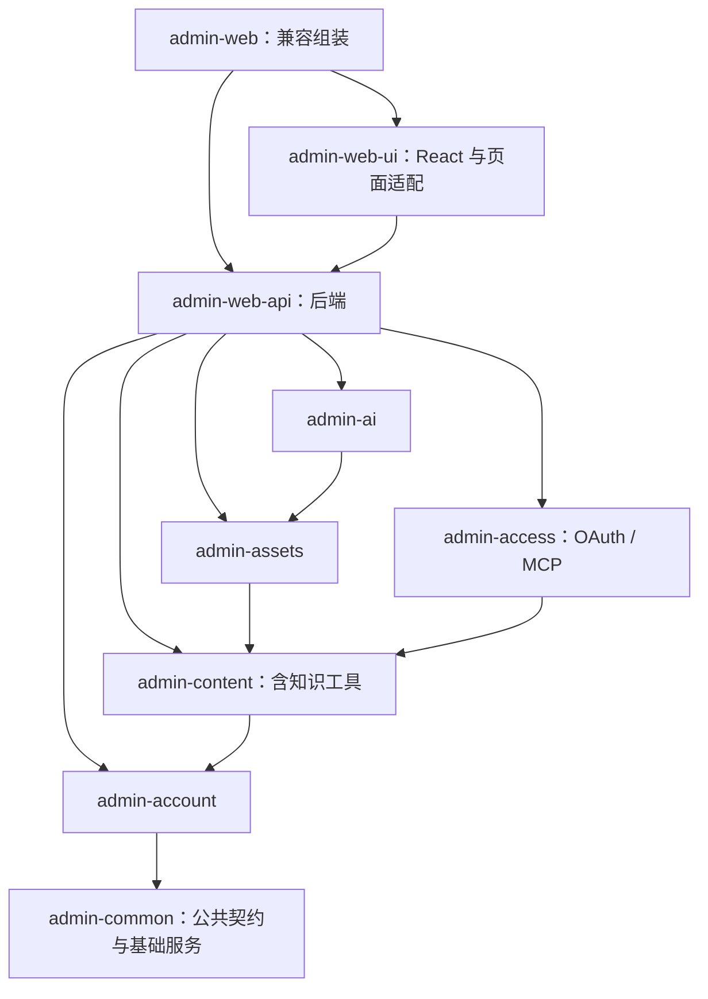

# 后台模块化实施记录

## 目标与兼容范围

在当前仓库内拆分 Maven 模块，降低阅读和修改单个功能时的依赖范围。功能模块拥有自己的 Controller、服务、DTO、资源和测试；`zrlog-admin-web-api` 保留后端组装、公共 API，`zrlog-admin-web-ui` 拥有整套 React 前端与页面适配，`zrlog-admin-web` 只做兼容组装。对外继续提供原 `com.hibegin:zrlog-admin-web` 构件，保留现有 URL、JSON、数据库结构和配置含义。

复用 `WebSetupProvider`，不引入第二套模块 SPI。首期按启动参数禁用功能，同时停止对应路由与任务，并向前端提供实际启用的能力。暂不支持移除 JAR、热卸载或独立前端发布。普通 JDK ZIP/WAR 继续排除 Polyglot，Native 注册随功能迁移。

## 数据与依赖归属

| 模块 | 归属 |
| --- | --- |
| account | 登录、身份、账号安全、成员和基础权限 |
| content | 文章、版本、发布、分类、标签、评论、知识检索及文章工具 |
| assets | 文件上传、资源管理和资源引用 |
| ai | 模型配置、对话、写作辅助及内部工具消费 |
| access | 第三方应用、授权、OAuth、个人 token、MCP |
| web-api | Java 后端组装、公共 API；设置、主题管理、运维先按包维护；不依赖 UI |
| web-ui | React、页面渲染、PWA、后台页面静态化及其资源；依赖 API |
| web | 兼容原构件坐标，组装 API/UI、开发入口和跨模块集成测试 |

内容服务不依赖 AI 或 access。AI 与 MCP 复用内容工具，服务端传入可信身份并在调用时重新检查权限。外部调用额外受到应用授权范围限制。关闭 AI 不影响 MCP，关闭 access 不影响内部 AI 工具，MCP 可在 access 内单独关闭。跨功能流程放在明确的组装服务中，不进行 Controller 间调用。仅为实际共用的契约保留必要接口，不为每个服务添加接口或通用事件框架。

## 实施切片

- [x] 统一主工程与 admin 开发入口的 WebSetupProvider 加载；移除知识库对 OAuth 的反向依赖。
- [x] 解开混合服务和 Controller：站点配置/AI 会话、文章/AI 写作、账号/外部授权、文件/内容引用；修复普通 JDK 文章发布的引擎缺席路径。
- [x] 建立父工程和功能子模块，迁移实际代码、资源、测试与 Native 注册；保留构件兼容及前端单次构建。
- [x] 分散路由和启动职责至功能 Provider，实现启动禁用与能力输出，覆盖 AI/access/MCP 独立组合。
- [x] 前端根据能力状态隐藏入口并禁止路由和操作；保留用户已有权限控制。
- [x] 更新脚本与工程说明，完成后台测试、前端检查/构建与主工程 ZIP/WAR 验证。
- [x] 分离实际 API/UI 构件；验证 API 在 classpath 中没有 UI 包时可用。
- [x] 完成最终 API/UI 构件的 Native 二进制运行验收。
- [x] 使用用户授权的 Playwright 完成桌面、移动端及模块禁用组合的浏览器验收。

## 验证重点

默认启用时已有接口行为保持兼容。禁用后的接口不能通过 Controller 默认方法映射或旧 URL 绕过。后台基础身份认证不能因关闭外部 access 而缺失。权限在异步 AI 工具执行时仍然生效。文章写入继续经过权限、版本、审计和缓存/静态刷新链路。生产与内存开发入口采用同一发现/禁用规则，开发安装辅助类不进入最终 JAR。

已建立 Maven 子模块。当前结果及验收限制如下。

## 2026-09-27：功能模块、启动开关与前端

根 POM 现在是 `zrlog-admin-web-parent`。原 `com.hibegin:zrlog-admin-web` 构件坐标保持不变，由同仓库的功能构件组成。保留 Java 包名和公开 URL，迁移时未重命名数据表或持久化键。MCP 的服务、协议 DTO 和 interceptor 位于 access；知识检索与文章工具位于 content。

前后端是不同 Maven 构件，不只是目录改名：

- `zrlog-admin-web-api`：只含后端，不打包 `admin/` 页面资源或页面 Controller；编译和测试 classpath 都不依赖 UI。
- `zrlog-admin-web-ui`：持有 React 工程、`AdminPageService`、页面 Controller、PWA/manifest 和后台页面静态化插件。其 JSON 接口仅服务这些 UI 能力。
- `zrlog-admin-web`：保留原 Maven 坐标，通过依赖 API/UI 提供完整后台，普通 JAR 仅含组装元数据；开发入口只进入 starter。

`nodeBuild` 仅在 UI 模块执行一次构建，工作目录是 `zrlog-admin-web-ui/src/main/frontend`；`build` 输出只打包进 UI JAR。API 的公共配置响应由 `AdminResourceService` 提供，无 UI 时账号返回空的页面缓存 URI，不再依赖页面资源实例。功能 Controller 仍属于各后端功能模块。

真实 JAR 检查：API 约 104 KB，页面资源和页面 Controller 均为 0；UI 约 3.52 MB，含 277 条后台页面资源；兼容组装包约 2.6 KB，没有复制 API 或 UI 内容。

编译依赖如下（箭头指向被依赖方；各层可使用传递依赖）：

`common` 限于 HTTP/URL/错误契约、审计、通知存储和通用设置。功能自己的 DTO/Controller/资源/Native 类型清单保留在功能模块；跨模块组合 API、模板管理、运维与 dashboard 数据留在 web-api；HTML 页面适配归 UI。通用测试夹具现由 base 的 `zrlog-test-support` 提供；后台专用夹具在 common 的测试源码中，通过 tests classifier 共享。两者均仅以 test scope 使用，不进入产品运行时。

两个实际需要的反向调用通过现有 `ZrLogConfig.getWebSetup(Class)` 查询启用能力：content 的 `ArticleAssistant` 由 AI 实现，account 的 `AvatarStorage` 由 assets 实现。不新增注册中心或事件总线。文章创建/删除后的会话维护、编辑器数据补充、发布检查留在 AI；正常发布、版本、审计及缓存刷新留在 content。消息中心接收摘要值，不再引用 AI/文件管理响应 DTO。

### 启动配置

统一使用 `DISABLE_MODULES`，逗号分隔，启动时生效：

| Provider 名称 | 必须先启用的 Provider |
| --- | --- |
| admin | 无，后台组装入口 |
| admin-account | admin |
| admin-content | admin、admin-account |
| admin-assets | admin、admin-account、admin-content |
| admin-ai | admin、admin-content、admin-assets |
| admin-access | admin、admin-account |
| admin-mcp | admin-access、admin-content |
| admin-ui | admin |

例如：`DISABLE_MODULES=admin-ai` 保留 OAuth 和 MCP；`DISABLE_MODULES=admin-access` 连带关闭 MCP，内部 AI 知识工具继续可用；`DISABLE_MODULES=admin-mcp` 保留第三方应用和个人 token。依赖被显式禁用时按顺序跳过依赖方；缺失、创建失败或顺序错误不能启用依赖方。`WEB_SETUP_STRICT=true` 对异常装配报错。`admin-account` 是后台身份基础，关闭后所有业务功能都会被跳过，仅剩宿主。`DISABLE_MODULES=admin-ui` 只停止后台页面、PWA 与页面静态化，不停止业务 API、AI 或 MCP。

关闭模块后不注册其 API，旧方法别名也不能绕过。account 的登录和权限检查不依赖外部 access。普通成员的来源校验改用中立异常，但保留原 `error`、`errorCode` 与消息，避免拆分改变客户端响应。

后台资源响应新增 `capabilities`（account/content/assets/ai/access/mcp）。前端保留单一构建，根据服务器状态过滤菜单、搜索、设置导航和页面请求；AI 关闭时不挂载助手按钮、不向编辑器传入 AI 配置、不显示描述优化/发布检查入口；MCP 关闭时不展示连接说明。旧服务器未提供该字段时保持原行为，现有账户权限仍独立检查。

浏览器验收发现：直达已禁用功能的页面时，SSR 会把缺失的 API 路由传入权限检查，导致 500。`AdminPageService` 现在对未注册路由保留已认证的页面壳、身份和能力数据，由前端显示现有 404 页面；已注册路由仍执行原权限检查。回归测试覆盖禁用 AI 设置和个人 token 页面，两类页面均不会请求已禁用的 API。

### 代码量

统计实际主 Java 源码，包含 DTO/注释/空行，不含测试、前端、生成物；用于比较维护范围，不作为复杂度或工作量指标。

| 模块 | Java 文件 | 行数 |
| --- | ---: | ---: |
| common | 60 | 3,895 |
| account | 49 | 3,895 |
| content | 60 | 5,087 |
| assets | 24 | 2,451 |
| ai | 63 | 5,986 |
| access | 25 | 1,985 |
| web-api | 51 | 3,875 |
| web-ui 的 Java 页面适配 | 18 | 1,372 |
| web 的开发入口 | 2 | 316 |
| 合计 | 352 | 28,862 |

相对本次重构前 HEAD：318 文件 / 28,196 行，净增 666 行（约 2.4%）。主要新增为功能装配、启动能力和必要接口。拆分本身不会减少已有业务代码；后续优先压缩 `AIToolService`、助手前端与 dashboard 的复杂方法，不继续把小功能细拆成独立工程。

### 验证结果与限制

- base：462 项测试通过；共享 Provider 加载器和依赖禁用组合通过。
- admin：601 项后端测试通过，包含 Controller 反射配置覆盖和缺失路由的 SSR 回归测试，分布在功能模块和 web 集成测试中；DTO 契约扫描已覆盖所有模块，未因迁移目录而减少覆盖。新增 API 无 UI classpath 的启动/账号/公共配置测试，模块组合覆盖单独关闭 `admin-ui`。
- 前端：45 套 / 347 项测试通过；type-check、生产 build 通过。包含禁用页面即使存在缓存也不发请求、不渲染的测试。
- 工程护栏、5 个公开 API 契约检查、12 项模型目录同步脚本测试通过；已更新源码扫描、模型目录工作流和开发启动脚本的路径。
- 同步 ops 的发布拓扑配置：允许版本变换全部模块 POM、核验全部发布构件，并用根属性管理 install-web 版本；25 项发布执行器测试通过，根 POM 依赖目标和构件清单逐一校验通过。只修改发布配套配置，未执行发布。
- 主工程：在包含当前工作区修改的临时副本中通过 44 项测试；真实 ZIP/WAR 包契约均通过，普通 Java 包没有 Polyglot/GraalJS/Hexo，也没有测试夹具。ZIP 真实 SQLite 安装、登录、页面/PWA 验证通过；关闭 AI 后 MCP 工具调用正常，关闭 access 后文章与 AI 设置仍可读，关闭 UI 后 API、AI、MCP 正常。完整主工程关闭 MCP 后，请求可能进入已有博客 HTML fallback 返回 200，但不存在 MCP JSON-RPC 处理器；不能仅按 HTTP 状态判断是否启用。
- 开发入口：真实内存安装启动、登录通过。关闭 access 后资源响应返回 ai=true/access=false/mcp=false，文章与 AI 设置接口返回 200，MCP 与 OAuth 发现端点返回 404。原本地配置未改写。
- 发布 JAR 不含 Application、DevZrLogConfig、MemoryApplication 或 memory 配置；开发用 starter classifier 保留 Application/DevZrLogConfig 和正确的 lib manifest，排除 MemoryApplication。
- Native：各模块显式 DTO 清单、WebAuthn 反射 metadata、资源聚合 smoke 测试通过。补齐 7 个模块的 32 个 Controller 构造器/路由方法反射配置，并按实际路由检查覆盖，修复无数据库采样时只注册构造器、遗漏方法调用的问题。已使用 `/tmp` 中校验过的官方 GraalVM 25 完成最终 API/UI 构件的真实 agent 采样和 Native 编译，没有修改全局 JDK。新二进制在非空 context path 下通过真实 SQLite 安装、登录、文章接口及页面/PWA 检查；关闭 AI 后 MCP tools/list 与 search_articles 可用，关闭 access 后文章与 AI 设置可读，关闭 UI 后 API、AI、MCP 仍启用。采样中的既有枚举空对象及未安装数据库告警不作为功能接口通过的依据。
- 安全扫描配置：后台 CodeQL/Dependabot 与新前端 manifest 路径核验通过；全仓检查另报 base 既有 CodeQL 配置漂移，不属于本次目录迁移。
- 浏览器：使用用户授权的 Playwright 和本机 Chrome，在最终 Native 二进制上完成 1440×1000 桌面、390×900 移动端验收。覆盖登录、控制台、文章列表、编辑器、站点设置、AI 设置、个人 token 和外观页面，以及移动导航开合、深色主题预览/撤销、长表单滚动。AI/access/MCP 单独禁用的入口与页面行为符合能力状态；禁用功能直达页面显示 404，且对应 API 请求为 0。无未捕获页面异常，布局稳定后无页面横向溢出。38 张最终截图与检查日志保存在本地 `/tmp/zrlog-module-ui-review/`，索引为 `review.md`，不进入仓库。

本轮模块化实施、真实 Java/Native 运行和浏览器验收已完成；跨仓库配套改动涉及 admin、base、主工程和 ops。

## 共享测试支持后续调整

`zrlog-admin-test-support` 已移除。数据库隔离、SQL schema 加载、SQLite 清理、D1 风格 adapter、日志捕获及 MemoryRuntime 下沉到 base 的 `zrlog-test-support`；AdminResource、身份和后台种子数据留在 admin-common 的测试源码。MemoryApplication 移到 web 的测试源码，使用 test classpath，不再要求运行时依赖 H2 或 install-web。此前代码量表是模块化验收时的快照。
